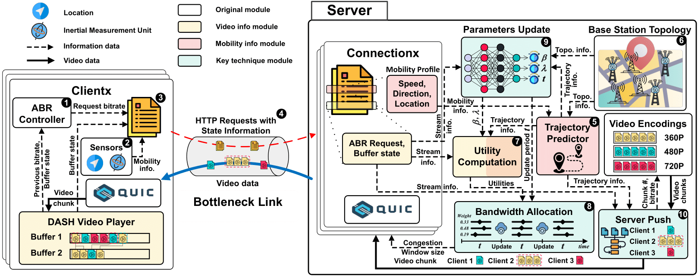

# VSiM implementation in  QUIC-go

**Please read https://github.com/lucas-clemente/quic-go to figure out how to setup the quic-go code first.**


[](https://godoc.org/github.com/lucas-clemente/quic-go)
[](https://travis-ci.org/lucas-clemente/quic-go)
[](https://ci.appveyor.com/project/lucas-clemente/quic-go/branch/master)
[](https://codecov.io/gh/lucas-clemente/quic-go/)

quic-go is an implementation of the [QUIC](https://en.wikipedia.org/wiki/QUIC) protocol in Go.

## Framework



## Standard Setup for QUIC-go

We currently support Go 1.9+.

Installing and updating dependencies:

    go get -t -u ./...

Running tests:

    go test ./...

## Standard Setup for dash.js

**Please read https://github.com/Dash-Industry-Forum/dash.js/wiki to figure out how to setup the dash player.**

1. Install Core Dependencies
    * [install nodejs](http://nodejs.org/)
    * [install grunt](http://gruntjs.com/getting-started)
        * ```npm install -g grunt-cli```
2. Checkout project repository (default branch: development)
    * ```git clone https://github.com/Dash-Industry-Forum/dash.js.git```
3. Install dependencies
    * ```npm install```
4. Build, watch file changes and launch samples page, which has links that point to reference player and to other examples (basic examples, captioning, ads, live, etc).
    * ```grunt dev```

### Running the example server

    go run example/pdd/server/server_v8.0 with 2 clients.go 


Using Chrome:

    http://localhost:6060/dash.js/samples/ppd_dash_player/

